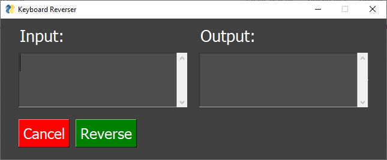
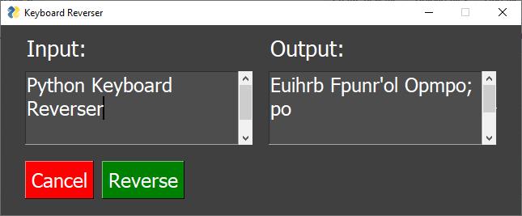

# python-keyboard-reverser
It flips each character with its horizontal counterpart based on the QWERTY layout. It does not support numbers or backslash at the moment.

Requires PySimpleGUI.

### How to use:

Run `keyboard-reverser-gui.exe` from the zip file.
Type what you want to be reversed in the input box.
Hit the reverse button.

### Things I need to do:

- [ ] Add number support.
- [ ] Add backslash support (if possible).
